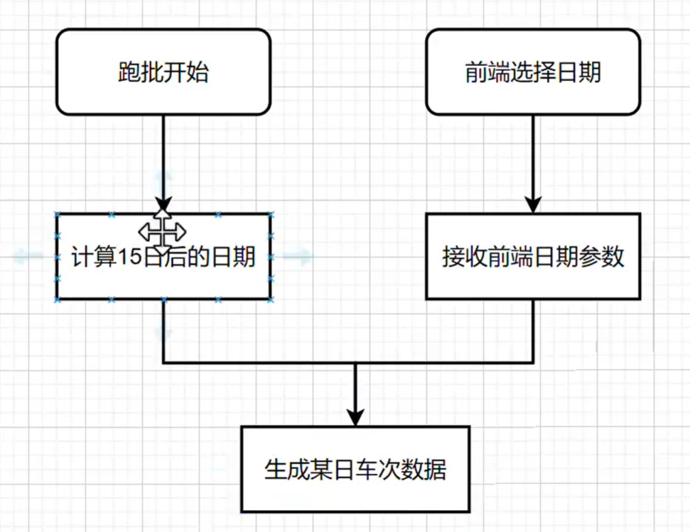
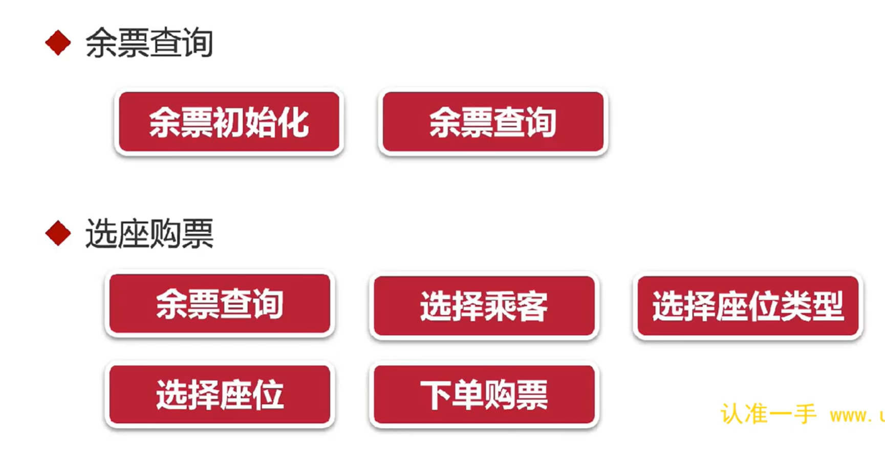

# 仿12306售票系统实战开发
## 第二章
### 2. SpringBoot3新特性
#### 2.1 AOT和JIT
JIT(Just In Time)：即时编译，JVM在运行时将字节码编译成机器码，以提高运行效率。
AOT(Ahead Of Time)：预编译，JVM在运行之前将字节码编译成机器码，以提高启动速度。
AOT的优点：
* 启动和运行速度快
* 打包体积小
缺点：
* 编译后的程序不支持跨平台
* buzhichi动态功能，如AOP

并发生成问题：热点应用重启后，出现业务超时， 几分钟后恢复正常
解决方法：
* 预热：初始让程序自动运行热点代码几百次
* 流量控制：启动时小流量，运行几分钟后再放到正常流量
  
网关模块：生产发布时，只有gateway需要配置外网IP，其他模块都只开放内网访问，外网访问不了，保证应用安全

### 3. 数据库
mysql8.0安装
* 下载镜像：docker pull mysql:8.0.20
* 启动镜像：docker run -p 3307:3306 --name mysql8 -e MYSQL_ROOT_PASSWORD=123456 -d mysql:8.0.20
* 创建挂载目录：mkdir -p /docker/mysql8.0.20/


## 第四章
### 4.20 详解雪花算法
生成ID的方式：
    * 自增ID不适合分布式数据库，分表分库场景，适合小型项目
    * UUID会影响索引效率，因为UUID是无序的，用一堆无序的ID来构建一个有序的索引目录，性能上肯定有问题的
    * 雪花算法 

    ```java
    <!-- 拿到雪花算法生成的ID -->
    IdUtil.getSnowflake(1,1).nextId()
    ```


**中间10bit-工作机器ID：前5bit是数据中心的id，后5bit是机器的id。 序列号是解决同一ms同一台机器生产多个id，得到不同的序列号，如果当前ms序列号用完了，会阻塞到下1ms**

1. 雪花算法的问题： 
   1. 数据中心，机器ID设置：开机查询数据库、redis
   2. 时钟回拨：如果发生时钟回拨，会导致生成的ID重复，解决方法：等待时钟回拨结束，再生成ID 
2. 特点：
   1. 生成的ID是有序的
   2. 生成的ID是唯一的
   3. 生成的ID是分布式的
   4. 生成的ID是高性能的
   
## 第五章
### 5.4 web模块集成AntDesignVue

### 5.5 短信验证码登录流程讲解
存在的问题：短信攻击
* 同一个手机号不断发短信
* 用不同的手机号不断发短信
解决方法：使用图形验证码防止短信攻击
1. 发送短信验证码
   
2. 登录

3. 短信+图形验证码登录


## 第六章
### 6.1 实现JWT单点登录（一次登录到处访问）

1. jwt原理
   * jwt是一种无状态的认证方式，不需要在服务端保存用户的认证信息
   * jwt是一种基于token的认证方式，用户登录成功后，服务端生成一个token返回给客户端，客户端保存token，之后每次请求都携带token
   * token是一种加密字符串，包含用户信息，有效期等
   * token的生成：header.payload.signature
   * header：base64编码的json字符串，包含token类型和加密算法
   * payload：base64编码的json字符串，包含用户信息，有效期等
   * signature：签名，由header和payload生成，防止token被篡改
2. jwt的问题
   1. token被解密：加盐值（密钥），每个项目的盐值不一样
   2. token被拿到第三方使用：使用限流

### 6.6 vuex配合h5的session解决浏览器刷新问题

## 第7章
**完成乘车人增删查改功能，为后面的代码生成器做准备**
### 7.11 解决前后端交互Long类型精度丢失的问题
在Long字段上添加@JsonSerialize(using= ToStringSerializer.class)

### 7.14 乘车人编辑接口开发
如果前端传过来的Passenger的id不为空，则是编辑修改，否则，就是插入新乘客

## 第八章
自制前后端代码生成器提高开发效率
* 学习代码生成器原理，学习freemarker
* 学会下写自己的生成器，可用于导出复制excel，页面静态化等

## 第九章
business模块属于管理后台，主要是对订单的管理，包括订单的查询、删除、导出等功能

* 是否加冗余字段，看使用场景是查多还是写多，差多就可以考虑加冗余字段

### 9.17 实现按车次生成车座功能
批量插入需要考虑的问题：事务 
   // 清空当前车次下的所有的座位记录 
   // 查找当前车次下的所有的车厢 
   // 循环生成每个车厢的座位 
      // 拿到车厢数据：行数、座位类型(得到列数) 
      // 根据车厢的座位类型，筛选出所有的列，比如车箱类型是一等座，则筛选出columnList={ACDF}
      
      // 循环行数
         
            // 循环列数
            
               // 构造座位数据并保存数据库
               
## 第十章 定时调度模块
### 10.4 定时任务（cron)
cron表达式：秒 分 时 日 月 周 年
定时任务三大要素：
   1. 执行的内容：功能逻辑
   2. 执行的策略：cron表达式
   3. 开关：开启定时任务
特点：
   1. 适合单体应用，不适合集群
   2. 没法实时更改定时任务状态和策略

## 第十一章 生成火车每日数据
通过火车基础数据生成每日火车数据
* 增加每日车次数据维护功能：车次、车站、车厢、座位
* 增加定时任务：每天从车次基础数据生成每日车次数据
 Quartz实战：适合集群，支持动态修改定时任务状态和策略
 ### 11.7 增加生成每日车次的定时任务
 
 生成每日所有车次信息，包括车次、车站、车厢、座位等信息
 * 先删除该车次的数据，再生成该车次的数据
 * 每日车次和车站是在基础数据车次、车站增加了日期字段，每日座位增加了日期和和售卖信息（有各个站点的售卖情况构成）
  
## 第十二章 基本的车票预定功能开发

* 余票查询会显示还有多少张票，票数如果实时通过sell去计算，会影响性能，所以应该另外做张表，直接存储余票数 （12306使用的是GemFile)
* 数据库常见设计行转列：比如座位字段分为商务座、一等座、二等座，直接分成商务座、一等座、二等座这三个字段。对于相对固定的枚举类型，就可以用行转列来展示，目的就是方便查询，适合读多写少的场景
* 视图和存储过程在以前的项目中经常用到，依靠数据库内部的算力，帮我们做很多复杂的功能，会占用较多的数据库资源，所以逐渐被淘汰掉。服务端资源不够可以加机器，数据库不好加，数据库资源更珍贵，所以有数据库缓存